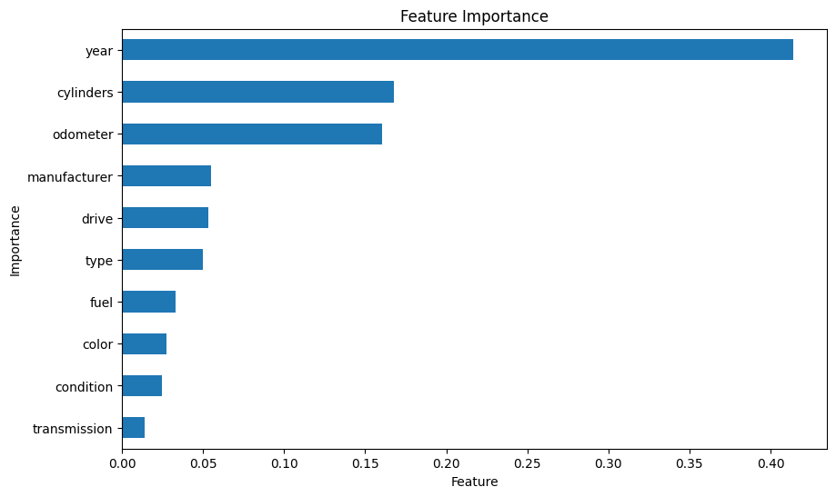

# Car Price Prediction

## Overview

This project focuses on predicting the price of used cars using a machine learning model. The model is trained on the [dataset](www.kaggle.com/datasets/austinreese/craigslist-carstrucks-data) of used cars and aims to provide accurate price estimates based on various features such as the year of the car, mileage, condition, and more. The prediction application is built using Streamlit, allowing users to input car details and receive price predictions.

<p align="center">
  
  
</p>


## Objective

The primary objective of this project is to develop a robust regression model to estimate car prices based on the following features:
- Year of the car
- Mileage (odometer reading in Kms)
- Car condition
- Number of cylinders
- Fuel type
- Transmission type
- Drive type
- Manufacturer
- Car type
- Car color

## Project Steps
The project follows the CRISP-DM (Cross-Industry Standard Process for Data Mining) methodology to ensure a structured approach to data mining and model building. Below is a summary of each CRISP-DM phase and the corresponding activities performed in this project:
### 1. Business Understanding
- **Goal**: Predict car prices based on features like year, mileage, and condition.
### 2. Data Understanding
- **Data**: [Used Cars Dataset](www.kaggle.com/datasets/austinreese/craigslist-carstrucks-data) Public Dataset by Craigslist.org.
- **Exploration**: Analyzed data distribution, handled missing values, and cleaned data.
### 3. Data Preparation
- **Cleaning**: Fixed missing values, removed outlier and transformed features.
- **Feature Engineering**: Prepared categorical variables reducing cardinality.
### 4. Modeling
- **Model**: Applied two different models to predict car prices.
- **Training**: Split data into training and testing sets and trained the model.
### 5. Evaluation
- **Assessment**: Evaluated and tunned the model performance using metrics like MAE and MSE.
### 6. Deployment
- **App**: Created a Streamlit app for users to get car price predictions.
### 7. Maintenance
- **Future Work**: Plan to improve the model and app based on feedback and performance.


## Tools and Technologies

- **Programming Language**: Python
- **Libraries**: Pandas, NumPy, Scikit-learn, Streamlit, Pickle
- **Model**: Linear Regression

## Project Structure

- **`data/`**: Contains the raw dataset and the clean dataset used for training the model.
- **`models/`**: Stores the trained machine learning model in `.pkl` format.
- **`src/`**: Contains the main application code.
  - **`main.py`**: The script that runs the Streamlit app.
- **`images/`**: Contains images used in the project.
- **`notebooks/`**: Jupyter Notebooks for exploratory data analysis and modeling of the ML.
- **`requirements.txt`**: Lists the dependencies required to run the project.

## Installation

1. **Clone the Repository**:
   ```bash
   git clone https://github.com/yourusername/car_price_prediction.git
   cd car_price_prediction
   ```

2. **Set Up the Virtual Environment**:
   
   Windows:
   ```bash
   python -m venv venv
   .\venv\Scripts\Activate
   ```

   Mac/Linux:
    ```bash
   python -m venv venv_test
   source venv_test/bin/activate
   ```
3. **Install Dependencies**:
   ```bash
   pip install -r requirements.txt
   ```

4. **Extract Large Files**:

   **Download and Extract**: <br>
   The following files have been compressed for size:<br>
   `data/vehicles.csv.zip`: Contains the dataset.<br>
   `models/model.pkl.zip`: Contains the trained model.

   **Instructions**:<br>
   Extract the ZIP files to their respective directories:<br>
   `vehicles.csv` for `data/`<br>
   `model.pkl` for `models/`

## Usage
1. **Run the Streamlit Application**:
   ```bash
   streamlit run src/main.py
   ```
2. **Interact with the App**: Open your browser and navigate to http://localhost:8501 to use the application.
   - **Input Fields**: Provide details about the car (e.g., year, mileage, condition).
   - **Click the "Calculate Price" Button**: Get the estimated price of the car displayed on the screen.

## Features
User-Friendly Interface: An intuitive Streamlit app for easy interaction.
Real-Time Predictions: Instant car price predictions based on user input.

## Results
The app provides an estimated price for a used car based on the input features. The predictions are generated using a linear regression model trained on historical car data.

## Future Work
- Model Improvement: Explore and implement more advanced regression techniques.
- Feature Engineering: Incorporate additional features to enhance model accuracy.
- User Experience Enhancements: Improve the UI/UX of the Streamlit application.

## Acknowledgments
- Data Source: [used cars dataset](www.kaggle.com/datasets/austinreese/craigslist-carstrucks-data)
- Libraries: Thanks to the maintainers of Pandas, NumPy, Scikit-learn, and Streamlit
